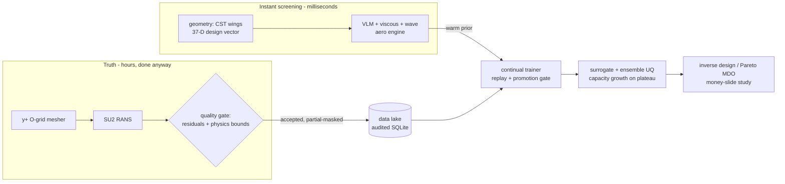

# AeroWing AI Pro

[](../../actions)


**A 3D aerodynamic design platform where the AI gets permanently smarter from every CFD run your team performs anyway.**

Adversarially-verified vortex-lattice physics provides instant screening; a
quality-gated continual-learning loop converts production CFD results into
surrogate accuracy; a function-preserving capacity-growth mechanism lets the
network expand without forgetting. Measured on real RANS anchors: **57% lower
drag-prediction error than the frozen preliminary tool after 9 CFD runs** —
with every step audited.

---

## Why this exists

In aerospace design, CFD is the scarce resource: thousands of core-hours per
case, thousands of cases per program. Meanwhile preliminary tools (vortex
lattice, panel methods) answer in milliseconds but carry ±10–20% drag error —
good enough to rank concepts, not to trust numbers. Between those two sits an
unclaimed opportunity:

> **Verification CFD runs anyway. Capture them, gate them, and train on them
> continuously — so every program makes the AI permanently better for free.**

This repository is a working, tested implementation of that loop at
wing-level fidelity, built to be honest about what it knows and doesn't.

## Evidence

**Physics core under adversarial verification.** The 3D VLM survived a
structured audit: analytic anchors (elliptic planform span efficiency = 1.002,
lift slope inside the horseshoe-VLM band, exact 2π/rad thin-airfoil limit
recovered as AR→∞), machine-exact Trefftz identities, and regression-pinned
discretization behavior (`tests/test_vlm_scheme_properties.py`).

**SU2 anchor setup validated against experiment.** Grid-converged RANS on the
ONERA M6 wing reproduces the AGARD AR-138 polar — CL = 0.134 / 0.271 / 0.493
at α = 1.5° / 3.06° / 6° (M = 0.8395, Re = 11.7×10⁶ on MAC) — with a
coarse-to-medium refinement trend for discretization error bars.

**The flywheel learns from real CFD.** Money slide on quality-gated SU2
anchors (9 candidate designs / 5 holdout; CD RMSE vs RANS truth):

```
  CFD units | CD RMSE | vs frozen preliminary tool
          0 | 0.03167 |   -8%
          2 | 0.02927 |  -15%
          4 | 0.02749 |  -20%
          9 | 0.01496 |  -57%    (every further run shrinks it further)
```

Every link is instrumented: diverged runs are rejected by physics-bounds
gates, partial solver deliveries train only delivered columns, promotion is
holdout-gated, and capacity growth preserves the learned function exactly.

## Architecture



Deep dive: [`docs/CODE_TOUR.md`](docs/CODE_TOUR.md) — module-by-module guide,
test map, and the honest debt list.

## The novel mechanism: function-preserving capacity growth

When holdout improvement plateaus and enough real CFD has accrued, the
surrogate **grows**: a zero-initialized residual block is attached so the
network's function is preserved *exactly* at init (`G'(x) ≡ G(x)`), then
fine-tuned with **error-directed per-sample routing** —

```
w_i = sigmoid(|e_old,i| / τ) · (1 + relu(|e_old,i| − |e_new,i|))
```

solved regions receive half attention, improved regions are reinforced,
degraded regions get no bonus. Combined with replay-buffer fine-tuning and a
holdout promotion gate, this means: **scaling capacity never throws away what
was learned**, and gradients concentrate where the model is still wrong. The
trigger policy, function preservation, weight semantics, and state-dict
compatibility each have dedicated regression tests.

*Provenance:* the method was conceived in the author's earlier 2D research
prototype (`airfoil_ai`, formulations A/B/C for error-directed expansion) and
is re-engineered here for 3D production workflows — residual-block expansion,
masked multi-output losses, and a fully gated continual-learning ecosystem.

## Installation

```bash
git clone https://github.com/OWNER/aerowing-ai.git
cd aerowing-ai
python -m pip install -e ".[dev]"
pytest tests/ -q          # 80 passing, 1 xfail-documented
```

Requires Python ≥ 3.10, NumPy ≥ 2.0, PyTorch ≥ 2.0.

## Quickstart

```bash
aerowing info                                   # capabilities overview
aerowing analyze --case onera_m6                # instant VLM analysis
aerowing analyze --config onera_m6              # geometry+condition from YAML
aerowing train                                  # surrogate from generated corpus
aerowing inverse-design --target-cl 0.55 --target-mach 0.82
aerowing serve                                  # private localhost-only web UI

# the continuous-learning loop (the thesis):
aerowing mesher volume --wing onera_m6 --out mesh.su2   # mesh for SU2
# ... run SU2_CFD ...
aerowing continual ingest --forces forces_breakdown.dat --design-json case.json
aerowing continual collect --dir cfd_runs/ --update      # batch, idempotent
aerowing continual update --auto-grow                    # fine-tune + promote (+grow)

# prove what learning is worth:
aerowing continual mf-study --truth lake --designs 256 --holdout 64 \
    --budgets "0,32,128,256" --out study.json            # error-vs-CFD-cost curve
```

## Multi-fidelity study (the money slide)

`aerowing continual mf-study` measures accuracy gained per expensive label,
for two learners — a **flywheel** warm-started from the VLM-pretrained
surrogate vs a **cold** surrogate trained only on expensive labels. Two truth
modes exist, deliberately:

- `--truth engine`: synthetic stand-in labels. Mechanism demo only — *not* a
  real-accuracy claim, since the stand-in shares physics with the prior.
- `--truth lake`: accepted real-CFD rows from the data lake. Delivery masks
  honored end-to-end; undelivered outputs report `n/a`, never fabricated
  numbers. **This is the mode behind the Evidence table above.**

## Volume mesh generator (CFD fuel)

`aerowing mesher volume` builds structured hexahedral O-grids: y⁺≈1 wall
spacing from flat-plate skin-friction law, geometric growth solved
automatically, TE wake slit, far field at 15 MACs, optional `mirror_full_span`
(two-sided modeling — required for correct semi-span root closure; a free-root
half-wing measurably loses ~⅔ of lift vs the reflection-plane convention).
Jacobian validation runs before writing; inverted cells are reported, never
shipped.

## Uncertainty quantification (per-prediction bands)

`aerowing train --ensemble K` trains K lean, physics-regularized members;
predictions ship with ±2σ bands that (i) rank per-point error (pooled Spearman
≈ 0.5), (ii) tighten as labels accrue, and (iii) blow up honestly outside the
training box. **Not claimed: calibration** — coverage runs below nominal and
is documented as the open lever.

## Honest limitations

Documented in place rather than hidden:

- Wing-only potential-flow screening (no fuselage/tail interference); engine
  corrections are empirical priors calibrated on limited RANS data — by design,
  since closing that gap is the learning loop's job, not hand-tuning's.
- Steady-RANS anchors fail to converge for extreme twist-gradient geometries
  (> ~±0.3° spanwise range) on these O-grids — bisected, documented, gated out.
- Ensemble bands are not yet calibrated probabilities.
- Legacy calibration rows with mislabeled provenance are quarantined in the
  shipped lake history (`legacy_suspect`) and never trained on — kept as an
  audit trail of why provenance gates exist.

## Roadmap

- [ ] Fine-level grid convergence & TE/wake-cut rework for the O-grid
- [ ] Ensemble band calibration (member regularization tuning)
- [ ] Twist-aligned wake cut in the mesher (lift the twist-gradient limit)
- [ ] Config-level geometry (fuselage/tail) anchor support
- [ ] Ablation study: error-directed routing vs plain fine-tune vs EWC-style baselines

## Repository map

See [`docs/CODE_TOUR.md`](docs/CODE_TOUR.md) for the layered walkthrough.
Quick reference:

| Path | Role |
|---|---|
| `aerowing/geometry/` | CST parameterization, wing builder, benchmarks |
| `aerowing/solvers/` | VLM, viscous BL, wave drag, aero engine, SU2 driver |
| `aerowing/mesher_3d.py` | Structured hexahedral O-grid volume mesher |
| `aerowing/collector.py` + `aerowing/continual.py` | Ingestion seam, quality gate, data lake, trainer |
| `aerowing/models/` | Surrogate, trainer, generative VAE, ensemble UQ |
| `aerowing/multi_fidelity.py` | Error-vs-CFD-cost study harness |
| `cfd_anchors/` | Anchor-matrix builder + SU2 v8 shims |
| `tests/` | 85 tests: physics verification, scheme regression guards, learning-policy contracts |

## Privacy

The web studio binds to `127.0.0.1` only, vendors all assets locally (no CDN,
telemetry, or analytics), loads AI models exclusively from local checkpoints,
and refuses AI endpoints rather than returning random output when none exists.

## License

MIT — see [`LICENSE`](LICENSE).
